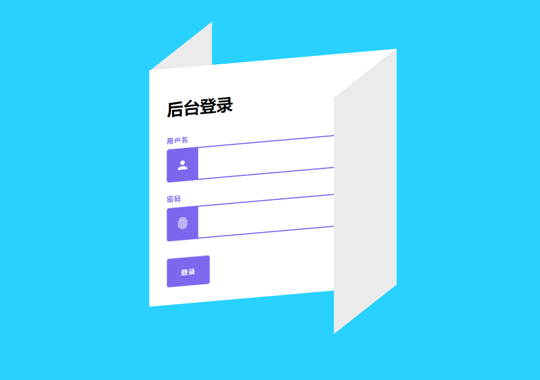
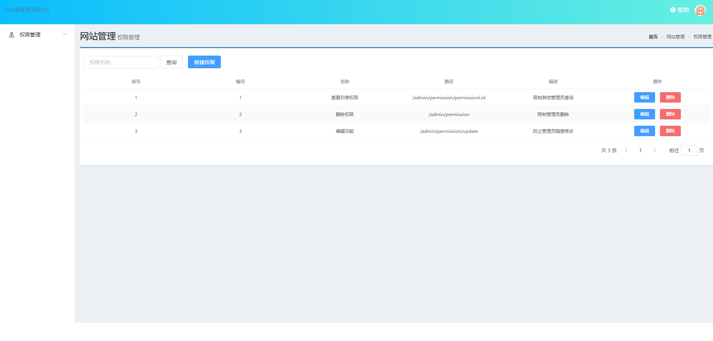

# <a href="http://www.dqstudy.work:8080/#/">博客</a>

 <code> blog</code> : 一款用于个人博客开发的模板，支持微服务改进与MongoDB改进评论模块。

接口可用APIFox 进行调试

# 文档

* <a href="./doc/api">API文档</a>
* <a href="./doc/sql">配置文档</a>

## QQ

 <a href="https://qm.qq.com/cgi-bin/qm/qr?k=4OvO7bgRAhSLX0J2WXVbCWbY7hL7gMYd&jump_from=webapi">2464838687</a>

## 技术栈

* SpringBoot
* Vue
* Redis
* Jwt 
* Shiro+Springsecurity加密

## 为啥要搭建博客系统模板

* 步入编程以来，人生的第一个项目无异于搭建一个个人博客（<code>blog</code>）平台，虽然当代博客以经接近饱和阶段，但是此项目中使用各种强大的技术栈，与设计思维，封装类型转化等，而不再是一个简单的博客。

* 本项目中利用<code>redis</code>将接口访问速度提升1000+倍，而不是传统被动访问接口直接访问<code>Mysql</code>

* 为什么此博客亮眼？ 使用 md5 +盐 、线程隔离 、springSecurity等主流技术， 

* 权限管理案例
* 本项目提供了完整的Spring Security 安全认证
  * root 权限控制url （账户：root  密码：<code>root</code>）
  * 成员（账户：dq  密码：<code>dq333</code>）

# <a href="http://www.dqstudy.work:8889/login.html">         ->                权限管理案例展示                         </a>

* 登录页

* 首页

